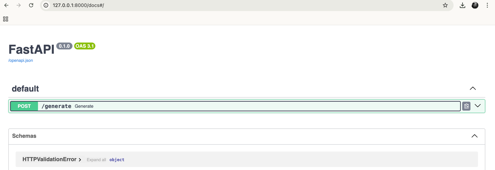

## Construyendo Workflows de IA con FastAPI y LangGraph

En esta sesión crearemos una aplicación basada en un LLM utilizando las siguientes herramientas:

- OpenAI: como LLM
- LangGraph: como orquestador de la lógica del agente
- FastAPI: (back-end) framework para definir nuestros endpoints
- Streamlit: (front-end) framework para visualizar e interactuar con el agente
- Docker: para meter la aplicación en un contenedor y poder desplegarla en otros entornos

En esta sesión nos centraremos en entender como encajan las diferentes piezas del proceso, como conectar unas con otras
y cuales la función de cada una. La lógica del agente será una llamada al LLM sencilla, que luego en función del caso de
uso se puede transformar simplemente modificando el grafo.


A continuación aparecen los pasos que seguir para la correcta creación e instalación de la práctica:

### 1. Setup del proyecto

Entro dentro de la carpeta del proyecto:
```
cd tema10_clase5_practica
```

Creamos un nuevo entorno virtual, con python >= 10. Para esto es libre que cada persona lo haga de la forma que más
acostumbrada está. En mi caso estoy haciendolo con conda:

```
conda create -n <myenv> python=3.10
conda activate <myenv>
```

Una vez lista y activada, instalamos las librerias con el siguiente comando:
```
pip install -r requirements.txt
```

Las librerías que necesitaremos se pueden encontrar dentro del requirements.txt.

👀 Para configurar el python correctamente en el environment del repositorio, ejecutar el comando `conda info --envs` 
para saber en que localización se encuentra nuestro environment.

### 2. Configuración key de OPENAI

Para la configuración de la key de openai como variable de entorno, podéis seguir este tutorial:
[Best Practices for API Key Safety](https://help.openai.com/en/articles/5112595-best-practices-for-api-key-safety).


### 3. Ejecutar el backend

Una vez tengamos todo instalado y configurado, podemos lanzar el servidor y comprobar que no hay problemas de
instalaciones ni de códidgo. Para ello ejecutar desde la terminal dentro del repositorio:

```
uvicorn backend:app --reload
```

Si se ejecuta correctamente, podremos encontrar nuestro endpoint en: `http://127.0.0.1:8000/docs`.



Podemos utilizar el siguiente texto para testear que la aplicación funciona:
```
{
  "user_input": "Sí porfa!",
  "history": [
    {"role": "user", "content": "Soy programadora y quiero mejorar en Python"},
    {"role": "assistant", "content": "Perfecto, ¿quieres que te recomiende recursos gratuitos para practicar?"}
  ]
}
```
Otra forma de testear que la API funciona sería lanzando un curl desde terminal:

```
curl -X POST "http://127.0.0.1:8000/chatbot" \
     -H "Content-Type: application/json" \
     -d '{"user_input":"Para que sirve este chatbot?"}'
```

### 4. Ejecutar el frontend

Para ejecutar nuestro frontend, como es un archivo de python sencillo, solo hará falta
```
python frontend.py
```
Es importante que esté lanzado el front, ya que llamaremos a ese endpoint para obtener respueta.

En la terminal aparecerá lo siguiente:

* Running on local URL:  http://127.0.0.1:7861
* Running on public URL: https://8b89da4077f347e4ff.gradio.live

Las URLs no siempre serán las msimas. La URL pública generada, podrá ser utilizada durante 1 semana por cualquier
persona como si fuera una web.

### 5. Dockerizar

Ya tenemos nuestra aplicación ejecutada, funcionando y recibiendo requests. Vamos a entender que opciones tenemos para
Dockerizarla y así elegir que nos conviene más. En Docker podemos crear un Dockerfile como hicimos en prácticas previas,
este quedaría de la siguiente forma: 

```
FROM python:3.10

WORKDIR /app
COPY . .

RUN pip install -r requirements.txt

# Comando para ejecutar el backend y el frontend en paralelo
CMD bash -c "python frontend.py & uvicorn backend:app --host 0.0.0.0 --port 8000"
```

En este caso estariamos creando un único contenedor que tendría dentro frontend y backend. Como punto negativo, si uno
de los dos falla, todo el entorno caerá. 

Por ello, en estas situaciones la mejor práctica sería crear dos contenedores diferentes ya que frontend (Gradio) y
backend (FastAPI) son servicios distintos. Para ello crearemos un `docker-compose.yml` y modificamos nuesto `Dockerfile`
para ejecutar directamente el yml. 

Lanzando:
```
docker compose build
```

se construirán nuestros contenedores. Para lanzarlo y poder corroborar que todo está correctamente construido
ejecutaremos:

```
docker compose up
```
O podemos directamente lanzar: `docker compose up --build` , así de cada vez se construirá y lanzará.


----
## Multiagente
En línea con lo comentado en la última sesión, añadí un ejemplo de multiagente para poder revisar como funcionaría
una estructura con diferentes partes comunicándose entre ellas.

Para lanzar este nuevo agente utilizando el front simplemente tendremos que modificar la url a la que 
apuntamos, ahora el endpoint será el de multiagente. Modificamos en el `frontend.py` la primera línea e incluimos
`http://localhost:8000/chatbot`.

El resto de ejecuciones y pasos a seguir serán exactamente iguales.